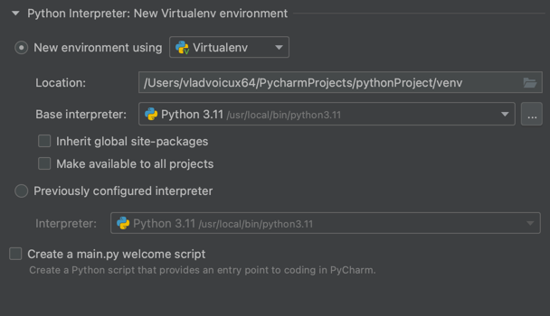
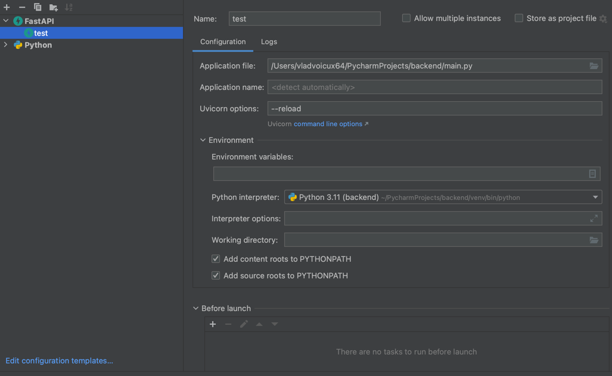

# Setup
Running the backend requires PyCharm 2023.1 or later. 
Create a new PyCharm project where you will clone the repository from VCS.

`git clone https://github.com/Smart-Hack-SegFault/backend.git`

Then: 

Choose a venv with Python 3.11 or later.

Install the requirements using 
`pip install -r requirements.txt`

Create a new FastAPI run configuration as shown:

Run the main.py script using said configuration.